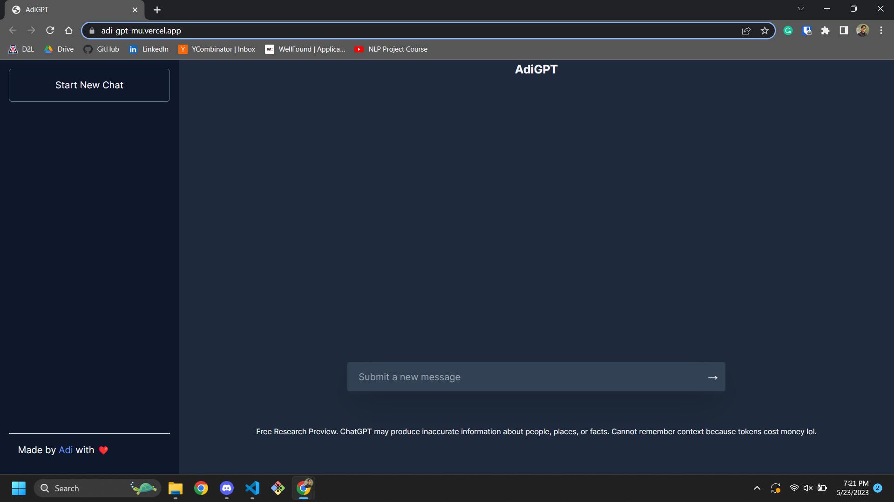

This is a [Next.js](https://nextjs.org/) project bootstrapped with [`create-next-app`](https://github.com/vercel/next.js/tree/canary/packages/create-next-app).

It is a ChatGPT clone called AdiGPT because, like me, it can't remember context (also because APIs are expensive). This is my first app with NextJS, Tailwind CSS and the OpenAI API. It uses React for the frontend and the NextJS Pages API for its backend all in TypeScript.



## Getting Started

First, run the development server:

```bash
npm run dev
```

Open [http://localhost:3000](http://localhost:3000) with your browser to see the result.

Orrr, use the live website on Vercel at [adi-gpt-mu.vercel.app](https://adi-gpt-mu.vercel.app/)
